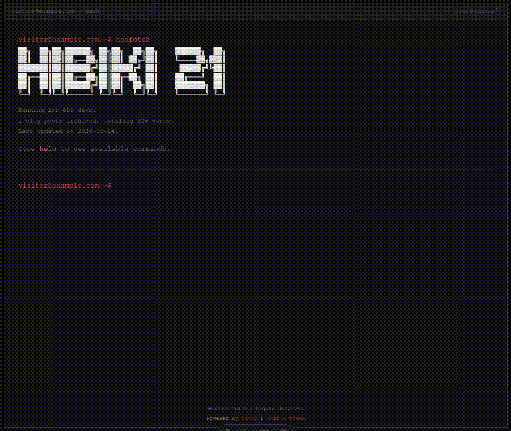
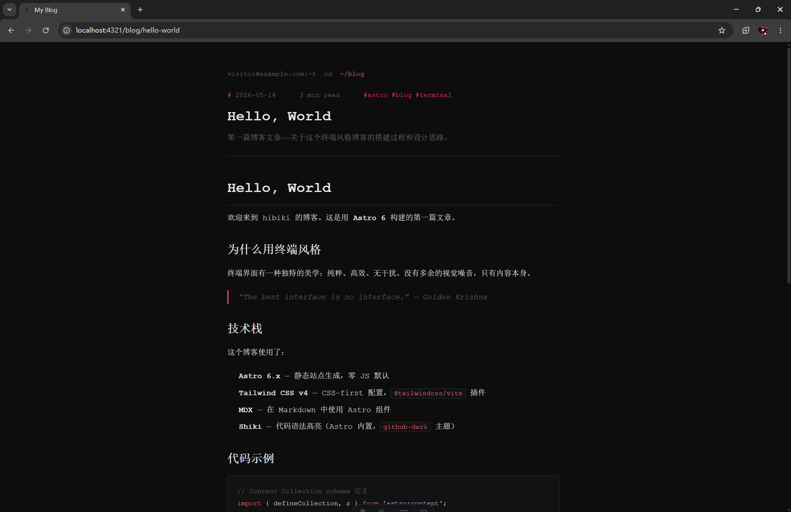

# Scar-B-theme

基于 [Astro 6](https://astro.build/) 和 Tailwind CSS v4 构建的终端风格个人博客主题。

这个名字来自于我爱的两部作品，少女前线（Scar-L & Scar-H）和飞跃巅峰（GunBuster），选择红色为基色调的一部分原因来自 Vanguard Sound 的专辑 Scarlet，另一部分是想要模仿 Sukeban Games 官方网页的视觉风格。没有什么特殊含义，仅仅是我喜欢。

[English](README.md)

---

## 预览

> 
>
> 
>
> #### [个人博客](hibiki17.icu)

---

## 特性

- 终端交互界面，支持命令输入、历史记录、Tab 自动补全
- 内置指令：`whoami`、`blog`、`projects`、`name`、`clear`、`help`
- 通过浏览器管理面板（`sudo admin`）完整配置，无需手动编辑文件
- 博客文章编辑器，支持 Markdown（`sudo blog`）
- 配置持久化到服务端文件，重新部署后不丢失
- ASCII Art 横幅、点阵图、站点信息块（支持 `{uptime}`、`{posts}`、`{words}`、`{last_update}` 变量）
- 备案号展示、版权文字、"Powered by" 角标
- 管理面板与博客面板各自独立密码保护（SHA-256 哈希，不存明文）
- 可从管理面板重命名或禁用任意内置指令
- 移动端响应式终端窗口，全站等宽字体

## 技术栈

| 层级     | 技术                            |
| -------- | ------------------------------- |
| 框架     | Astro 6（服务端模式）           |
| 样式     | Tailwind CSS v4                 |
| 适配器   | `@astrojs/node`（standalone） |
| 内容管理 | Astro Content Collections       |

## 快速开始

```bash
git clone https://github.com/Hibiki17YO/Scar-B-theme.git
cd Scar-B-theme
npm install
npm run dev
```

打开 `http://localhost:4321`，在终端输入 `help` 查看可用指令。

## 配置

默认配置位于 `src/config/terminal.config.ts` 的 `defaultConfig`。
运行时覆盖存储在 `src/config/user.config.json`，由管理面板写入，优先级更高，不应提交到 git。

启动开发服务器后，在终端输入 `sudo admin` 进入管理面板。
**默认管理密码为空**，部署前请在管理面板中设置密码。

### 主要配置项

| 字段                                    | 说明                          |
| --------------------------------------- | ----------------------------- |
| `username` / `hostname`             | 终端提示符显示内容            |
| `bannerArt`                           | 加载时显示的 ASCII Art        |
| `whoami`                              | `whoami` 指令输出的作者信息 |
| `adminCommand`                        | 触发管理面板的指令名（如 `sudo admin`） |
| `blogCommand`                         | 触发博客编辑器的指令名（如 `sudo blog`） |
| `showSiteInfo` / `siteInfoTemplate` | Banner 下方信息块             |
| `icpNumber`                           | ICP 备案号，点击跳转工信部    |
| `copyrightText`                       | 标题栏版权文字                |

> 密码**只能**通过管理面板的密码字段设置（以明文 `newAdminPass` / `newBlogPass` 提交，由服务端哈希后存储）。哈希字段 `adminPassHash` / `blogPassHash` 是内部实现细节，请勿手动编辑，且永远不会出现在 `GET /api/config` 响应中。

## 认证与 API

所有写接口（`PUT /api/config`、`POST/PUT/DELETE /api/posts/*`）都由 `src/middleware.ts` 做服务端 token 校验。

| 接口                          | 鉴权                                           |
| ----------------------------- | ---------------------------------------------- |
| `GET /api/config`           | 公开（已剥离哈希）                             |
| `PUT /api/config`           | `X-Admin-Token` 头部（值为管理密码的 SHA-256） |
| `POST /api/auth`            | 公开 — body `{ kind, hash }`，返回 200 / 401 / 429 |
| `POST/PUT/DELETE /api/posts/*` | `X-Blog-Token` 或 `X-Admin-Token`         |

登录流程：客户端把密码做 SHA-256 → POST 到 `/api/auth` 验证 → 通过后将该哈希存入 `sessionStorage`，作为后续写请求的 bearer token。

`/api/auth` 限流：每 IP 每 15 分钟最多 10 次失败，超出返回 429。

若管理密码尚未设置，`/api/config` 写入开放（首次部署引导用），**请在公网暴露前通过管理面板设置密码**。

`PUT /api/config` 接收 `{ reset: true }` 显式重置非密码字段；空 body `{}` 会被拒绝（400），避免误清空配置。

## 项目结构

```
src/
├── components/
│   └── Terminal.astro         # 主终端 UI
├── config/
│   ├── terminal.config.ts     # 默认配置（已提交）
│   └── user.config.json       # 运行时覆盖（勿提交）
├── content/
│   └── posts/                 # Markdown 博客文章
├── layouts/
│   ├── BaseLayout.astro
│   └── PostLayout.astro
└── pages/
    ├── index.astro            # 终端首页（动态 SSR）
    ├── admin.astro            # 配置管理面板
    ├── blog/                  # 博客列表与文章页
    ├── blog-admin/            # 文章编辑器
    └── api/
        ├── auth.ts            # POST: 验证密码哈希、签发 session token
        ├── config.ts          # GET/PUT 站点配置（PUT 需 X-Admin-Token）
        └── posts/             # 文章 CRUD（写操作需 X-Blog-Token）
```

## 部署

```bash
npm run build
node dist/server/entry.mjs
```

用 PM2 守护进程：

```bash
pm2 start dist/server/entry.mjs --name scar-b-theme
pm2 save
pm2 startup    # 生成 systemd 单元后，运行它打印出的命令
```

也可以直接用 systemd 单元文件管理。

### 环境变量

| 变量 | 默认值 | 用途 |
|---|---|---|
| `SCAR_CONFIG_PATH` | `src/config/user.config.json` | 站点配置文件路径 |
| `SCAR_POSTS_DIR` | `src/content/posts` | 文章目录 |
| `SCAR_RATE_LIMIT_MAX_FAILS` | `10` | 限流失败次数 |
| `SCAR_RATE_LIMIT_WINDOW_MS` | `900000` | 限流窗口（毫秒） |

参考 `.env.example`。

> **注意**：`src/config/user.config.json` 在运行时需要可写权限。本主题适合 VPS 部署，不适合 Vercel/Netlify 等文件系统只读的无服务器平台。

> **Content Collection 的 build 时快照**：Astro Content Collections 在 `npm run build` 时把 `src/content/posts` 快照到一起。编辑器在 build 后新建的文章**会**写入磁盘，但 `/blog/<slug>` 路由要重新 build 才会出现。Terminal 里的 `blog` 命令走 runtime API，不受影响。

## 许可证

MIT
